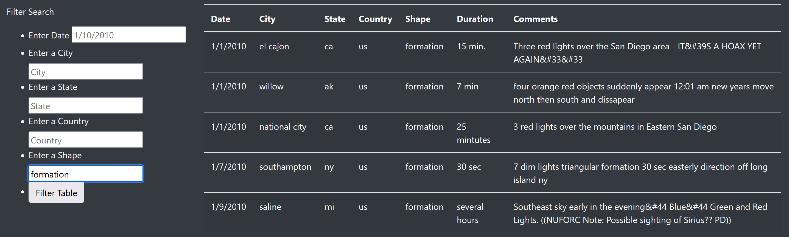
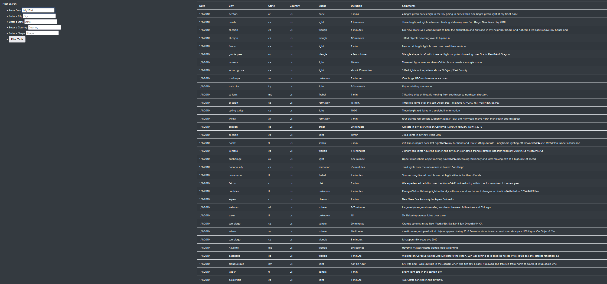

# UFO Sightings

## Overview
This project was meant to allow a user to filter a dataset of UFO sightings by date, city, state, country, and shape in a web app. It is meant to be used as the starting point for any hunches about sighting patterns by allowing for easy filtering by multiple input variables.

## Results

### UFO Tracking
The filtering could reveal a number of interesting findings about UFO sightings. A very useful filter is the "shape" combined with "date" filters, because it's possible that the same UFO is spotted in different parts of the country/world at different times on the same date. As seen in the screenshot, a very similar "formation" is seen first in Alaska (12:01 am) then presumably later, twice, in San Diego on New Year's Day.

### Date Anomalies
Another finding is the sheer number of sightings on New Year's Day versus the other days in the dataset. This could be due to:
- Increased levels of reporter intoxication
- Fireworks or other celebration materials mistaken for UFOs
- The aliens want to celebrate with us
The choice of conclusion is yours. 

## Summary
Drawbacks of this design include no catching of errors in input (for example, non-properly formatted date strings are ignored and display no results), as well as the lack of dropdown menus to limit choices for state, country, and shape. If you do not memorize the types of shapes from looking at the whole dataset, it's impossible to know what to input. A "Clear" or "Reset" button to revert the table to its original state would also help with further development.